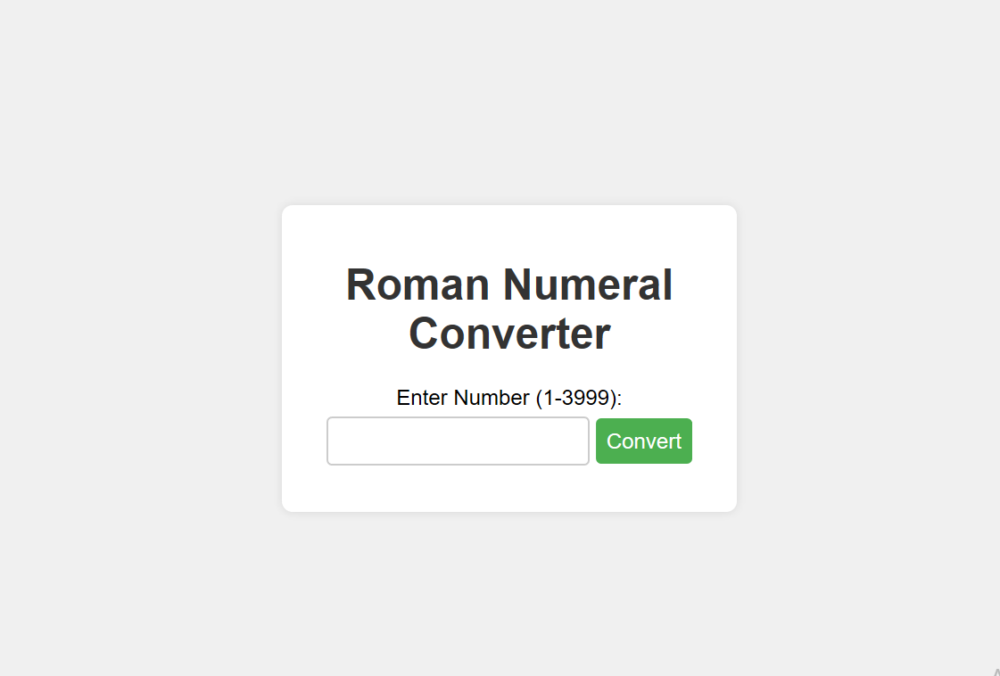

# Roman-numeral-converter

> This program converts Roman numerals to integers and vice versa. It accepts Roman numerals as strings and returns their corresponding integer values or converts integers into their Roman numeral representations.

## Demo 📸


1[livelink](i will add it after merge)

## Technologies Used 🛠️

- HTML
- CSS
- JavaScrip

## Usage 🎯

clone the project 

```bash
# git clone
```

```bash
# cd (choose a file)
```

```bash
code .
```

## Author 👩‍💻

- [Email](nooriamangal@gmail.com)
- [github](https://github.com/Nooria150)
 